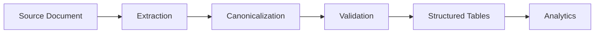

# Data Extraction Pipeline — Demo

A polished, **static** public demo that shows how an AI / document-processing
pipeline converts different types of manufacturing records into **structured,
traceable tables**.

> **Public Demo · Synthetic Data** — This repository contains synthetic data
> only. It is a static public demonstration and does **not** connect to any
> production system, database, or model. No real documents, formulations,
> identifiers, or infrastructure are included.

## What this demo demonstrates

The demo walks through two representative document types and shows how each is
turned into the same canonical, validated data model:

| Document | Nature | Extraction approach |
| --- | --- | --- |
| **Electronic Batch Record** | Digitally generated PDF | Deterministic text/table parser |
| **Scanned Weigh Sheet** | Scanned + handwritten | OCR / VLM extraction + deterministic document assembly |

For each document the demo displays:

- a **compact overview** (document type, processing method, pages, records,
  sections, material rows, validation status);
- a **pipeline visualization** of the processing stages;
- a **table explorer** (Records, Sections, Material Rows, Quality Checks);
- a **provenance panel** that opens when you click a material row, exposing the
  raw value, normalized value, source page, and validation status.

All examples are **pre-generated demonstration output**. The site does not run
any OCR or extraction model live.

## Electronic vs. scanned processing

- **Electronic Batch Record** — because the PDF is machine-generated, text and
  tables are extracted deterministically. Values are high-confidence and require
  no manual review.
- **Scanned Weigh Sheet** — the document is scanned and partly handwritten, so an
  OCR/VLM step produces per-page candidates that are then merged by a document
  assembler. Uncertain values are **flagged for review rather than silently
  corrected** (the demo includes one such synthetic warning).

## Canonical hierarchy

Every document is normalized into the same hierarchy:

```
Document → Record → Section → Material Row
```

- **Record** — a production run within the document.
- **Section** — a phase / formula group within a record.
- **Material Row** — an individual material line, with target and actual weights.

## Traceability & validation

Each extracted value carries a **source page** reference so it can be traced back
to the original document. A set of quality checks illustrate the validation
concepts:

- Primary keys unique
- Foreign-key relationships (Section → Record, Material Row → Section)
- Material row reconciliation
- Source-page provenance
- Review flags (uncertain values are surfaced, not hidden)

## Architecture



The public demo implements the read-only, right-hand side of this flow: it loads
two pre-generated synthetic examples and renders the canonical structure,
validation results, and provenance.

## Tech stack

- React + TypeScript
- Vite
- Plain CSS
- No backend, no database, no uploads, no authentication, no server-side
  processing — the two synthetic examples are bundled as static JSON.

## Run locally

```bash
npm install
npm run dev
```

Then open the URL printed by Vite (typically <http://localhost:5173>).

### Production build

```bash
npm run build
npm run preview
```

## Deployment (GitHub Pages)

A GitHub Actions workflow at
[.github/workflows/deploy-pages.yml](.github/workflows/deploy-pages.yml) builds
the site and deploys `dist/` to GitHub Pages. Vite uses a relative `base` so the
build works from a project subpath (`https://<user>.github.io/<repo>/`) without
extra configuration.

To enable: in the repository settings, set **Pages → Build and deployment →
Source → GitHub Actions**, then push to the default branch.

## Data & privacy

- All identifiers (e.g. `DEMO-EBR-001`, `DEMO-BATCH-001`, `MAT-DEMO-001`) are
  intentionally fictional.
- No real PDFs, tables, batch IDs, formulations, personnel, hostnames, or
  credentials are included.
- No `.env` or secret files are committed; `.gitignore` covers `.env*`, local
  data, and build artifacts.
